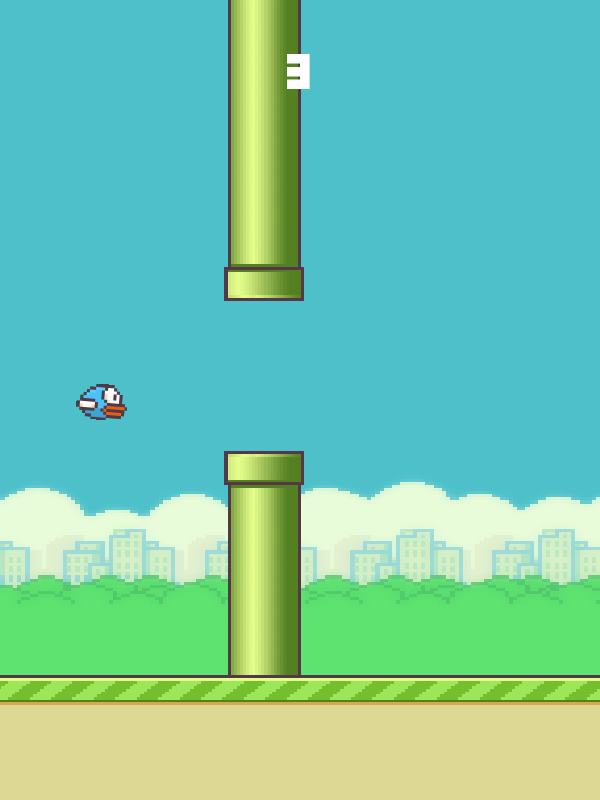

# Flappy Bird

## Overview

This is a simple Flappy Bird clone project created to learn Python and Pygame. It was developed following a video tutorial available on YouTube.

[Flappy Bird Tutorial](https://www.youtube.com/watch?v=UZg49z76cLw&source_ve_path=MjM4NTE&themeRefresh=1)

## Screenshot

  

